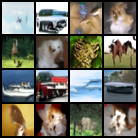

# DiT: Scalable Diffusion Model for Image Synthesis on CIFAR-10

This repository provides a custom implementation of **DiT (Diffusion Transformer)**, a scalable and efficient diffusion model built entirely on Vision Transformers (ViTs), trained on the CIFAR-10 dataset. DiT achieves state-of-the-art performance in image synthesis tasks by replacing the traditional convolutional UNet backbone with a hierarchical transformer-based architecture.

  

## Overview

**DiT** introduces a fully transformer-based architecture for denoising diffusion probabilistic models (DDPMs). Instead of the conventional CNN-based UNet structure, DiT employs Vision Transformers that process images as sequences of patches, enabling improved scalability and parallelism, particularly for large models and high-resolution data.

Original paper: [DiT: Scalable Diffusion Models with Transformers](https://arxiv.org/abs/2303.11305)

## Features

- Pure Vision Transformer-based generative diffusion model
- Trained on the CIFAR-10 dataset (32×32 resolution)
- Custom training and sampling scripts
- Modular and extensible design
- Visual sample outputs for model evaluation

## Installation

Clone the repository: https://github.com/Prateeksingh-moa/DiT_Implementation.git
